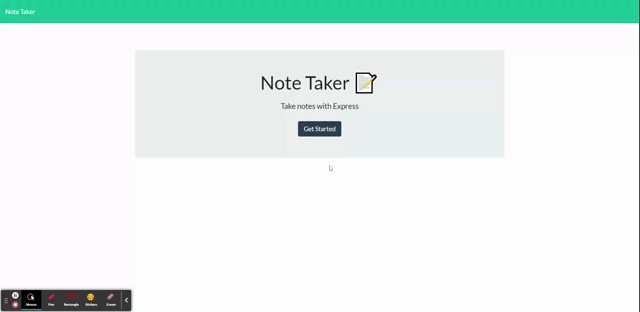

# Note Taker App

# Table of Contents
[Description](#description) - 
[Links](#links) - 
[Contact](#contact) - 
[Technologies](#technologies) - 
[License](#license)

## Description
This is a note taking app, it uses a .json file that has a stringified array in it to get, post, and delete the notes from. When the site is loaded to the notes page a get request is made to the server, which sendsback the json file from /api/notes that is parsed and used to update the notes that the user has saved on the left side of the screen. When the user inputs their note and clicks the save button a poat request is made to /api/notes to where the json file is parsed leaving an array of objects, the note is then made into an object and pushed to the array. Finally it rewrites the json file with the new note inside the array that is stringified and written to the json file. To delete notes a delete request is made to the server when the user hits the trashcan icon next to their saved note. This takes the ID that was associated with the note upon creation using UUID and sends it to the server as a parmaeter. The ID is then used to check each note in the json file after it has been parsed and finds the note in the json with a matching ID, it then splices the array at that index in the array removing the note. Everytime a note is saved or deleted a get request must also be made to update the saved notes area of the application. The server also was built to send a response back through the terminal for whenever a note is saved or deleted to the json file to let the user know that it was successful. A 404 page was also created for if the user ever goes to a route that is none exsistant for the application, this just simply redirects to the home page.

## Links
 
[Walkthrough Video](https://www.youtube.com/watch?v=T4ICrVqhsMQ)  
[Deployed App]()  
[GitHub](https://github.com/niklasertle/nje-note-taker)

## Contact
[GitHub Profile](https://github.com/niklasertle) 
Email: nik.ertle16@gmail.com

## Technologies

## License
[MIT License Copyright (c) 2021 niklasertle](LICENSE)